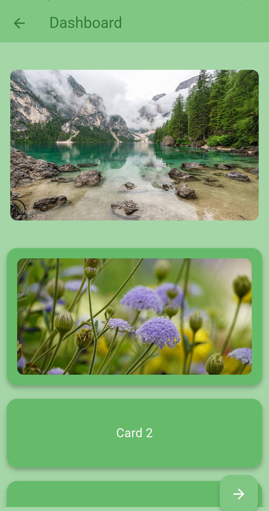
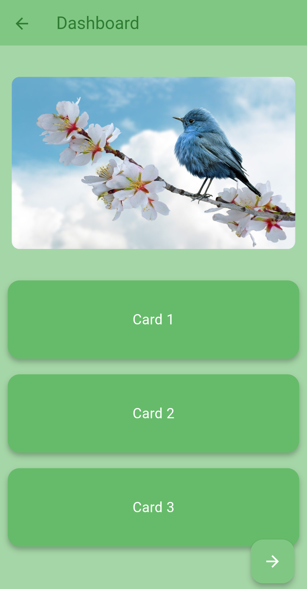
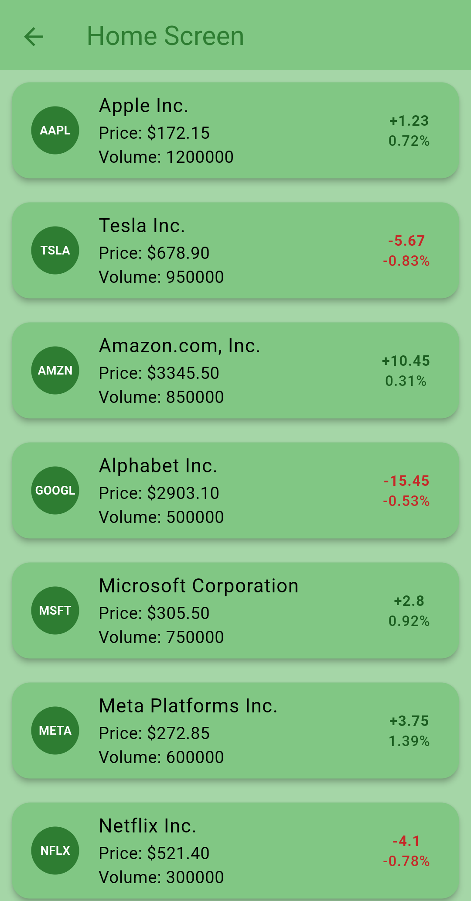
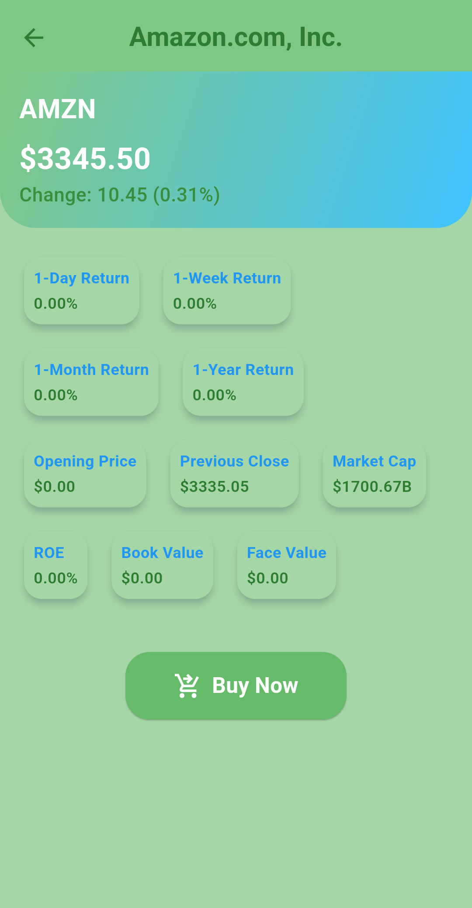
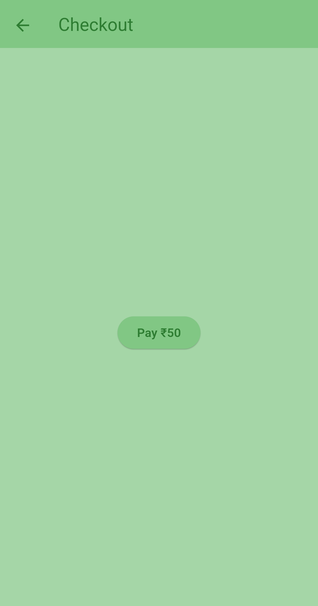

# Delente_Assignment-
This Flutter project is a feature-rich application that displays real-time stock data, integrates secure payment gateways (Razorpay), supports social authentication, and smooth navigation using GetX. It also includes advanced features like dynamic theming, multilingual support, and offline data storage.

## Features

Real-time Stock Data Display

Payment Gateway Integration (Razorpay/Stripe)

Multi-language Support (English, Spanish, French)

Dynamic Theme Switching (Light/Dark Mode)

Smooth Navigation using GetX with Named Routes

Social Login (Google, Facebook, Apple)

API Integration using Dio

Offline Data Storage

Push Notifications

Advanced Animations for Better UX

## Screenshots

### Login Screen

### Userinfo Screen

### Dashboard Screen

### Home Screen

### Details Screen

### Checkout Screen

### Payment Screen

### Setting Screen

## Project Structure

lib/
├── controllers/
│   └── payment_controller.dart
│   └── stock_controller.dart
├── core/
│   └── utils/constants/
├── modules/
│   ├── screens/
│   │   └── home_screen.dart
│   │   └── detail_screen.dart
│   │   └── payment_screen.dart
│   │   └── login_screen.dart
│   │   └── settings_screen.dart
│   └── widgets/
├── routes/
│   └── app_pages.dart
│   └── routes_name.dart
├── services/
│   └── api_service.dart
│   └── auth_service.dart
└── main.dart

## Setup Instructions

## Prerequisites

Flutter SDK: Ensure you have Flutter installed. Flutter Installation Guide

Android/iOS Emulator or Physical Device

## Clone the Repository

git clone https://github.com/your-repo/Delente_Assignment-.git
cd Delente_Assignment

## Install Dependencies

flutter pub get

## Run the App

flutter run

## Third-Party Service Setup

Razorpay/Stripe Payment Gateway

Create an Account: Razorpay Dashboard or Stripe Dashboard

Get API Key: Navigate to Settings → API Keys.

Update Key in Code:

'key': 'your key', // For Razorpay
'publishableKey': 'your key', // For Stripe

Dependencies: Ensure Razorpay and Stripe SDKs are added:

dependencies:
  razorpay_flutter: ^1.3.0
  flutter_stripe: ^9.0.0

## Android Configuration:

Add the following in android/app/src/main/AndroidManifest.xml:

<uses-permission android:name="android.permission.INTERNET" />

## Google, Facebook & Apple Social Login

## Google Sign-In:

Set up Firebase project: Firebase Console

Enable Google Sign-In under Authentication.

Add google-services.json to android/app/.

## Facebook Login:

Create App on Facebook Developers.

Add App ID to AndroidManifest.xml:

<meta-data android:name="com.facebook.sdk.ApplicationId" android:value="@string/facebook_app_id"/>

## API Integration (Stock Data)

Ensure the API URL is configured correctly in stock_controller.dart:

final response = await Dio().get('YOUR API KEY');

## Navigation Using Named Routes

All screens are managed using GetX Named Routes. Example:

Get.toNamed('/paymentScreen', arguments: {'isSuccess': true, 'message': 'Payment Successful'});

Routes are defined in app_pages.dart:

GetPage(
  name: '/paymentScreen',
  page: () => PaymentScreen(),
);

## Troubleshooting

Dependency Issues: Run flutter clean && flutter pub get.

Payment Errors: Check API key permissions in Razorpay/Stripe dashboards.

Build Errors: Ensure Android/iOS SDKs are up-to-date.

Social Login Issues: Verify credentials in Firebase/Facebook/Apple Developer Console.

## License

This project is licensed under the MIT License.

## Acknowledgements

Flutter

GetX

Razorpay

Firebase

